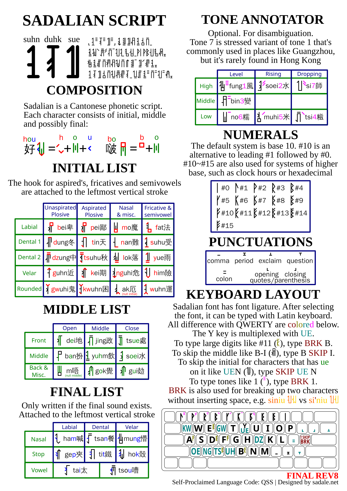

# Font Generation Python Scripts for Sadalian Script

Sadalian Script is a Cantonese phonetic script invented by Sadale. You can find more information here: [Sadalian Script Content Center](https://sadale.net/en/sadalian)

Due to the vast amount of characters in Sadalian Script, it isn't feasible to draw each of the characters manually. This repo contains Python scripts for generation of the font.

Since the scripts in this repo is pretty much meant for one-off use and the writing system had evolved over the years, the code is pretty janky. Fortunately, it works so let's not worry about that. :P

## Usage

```
python3 generateSvg.py  # Generate the glyphs in SVG format
python3 generateTtf-with-liga.py  # Using the SVG glyphs, generate the TTF fonts Sadalian{Regular,Bold,Italic,BoldItalic}.ttf and qss_mapping.py
python3 encoder.py  # With the qss_mapping.py, read Romanized Sadalian Script from stdin and output Sadalian Script Unicode characters to stdout
```

The font also supports font ligature. As an alternative to using `encoder.py`, you can select the Sadalian font in a text editor and type out the Romanized Sadalian Script. Then you can view the Sadalian text while you're typing.

## Sample Romanized Sadalian Script for Testing with the Font or encoder.py

```
yvnyvn saxcztlvi jvuhvi ji'6yvu ge, hvi jyn'1yim tux kynlei szx yvtlzt pixdvx.
kzidei gziyvu lei'5six tux lzx'4svm, yice yixgoi yux hix'1dvigan ge ranhvi lvi wuszxdzidoi.
```

(UDHR Article 1)

## Cheatsheet


